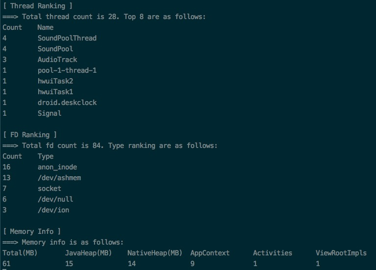

# android-system-res-monitor
An shell script to monitor key system resources for an android process, including thread, file descriptor and memory.

## Introduce
`sys-res-watcher.sh` is an shell script to monitor some key system resource info of running app. It Can be used to detect the resource leak in the process of testing your app as soon as possible. Now support the following kind of resource:
- Thread. Aggregate threads by name, and calculate the number of the same threads, then display the ranking.
- Fd(File Descriptor). Aggregate fd by type, and calculate the number of the same fd type, then display the ranking.
- Memory. Display the memory Pss info of app's process(main as default), including Total, DalvikHeap, NativeHeap and so on in different script running condition.

## Usage
Make sure your apk is debuggable or your mobile device is rooted, otherwise some resource info will not be displayed.

```bash
# 1. Push `sys-res-watcher.sh` to mobile device. Make sure /data/local/tmp directory is already exist.
adb push arch_watcher.sh /data/local/tmp

# 2. grant executable permission to script.
adb shell chmod a+x sys-res-watcher.sh

# 3. Launch your app, or you can launch it anytime while script is executing.

# 4. Choose one way to execute script, according to your actual situation.
# 4-a. If your mobile device is rooted:
adb shell
su
sh /data/local/tmp/sys-res-watcher.sh

# 4-b. If your app is debuggable:
adb shell
run-as <youku-package-name-of-app>
sh /data/local/tmp/sys-res-watcher.sh

# 4-c. If focus on detail memory info, whether or not app is debuggable:
adb shell "sh /data/local/tmp/sys-res-watcher.sh"
```

## Demonstration
The following demo is monitoring `Clock` app.

